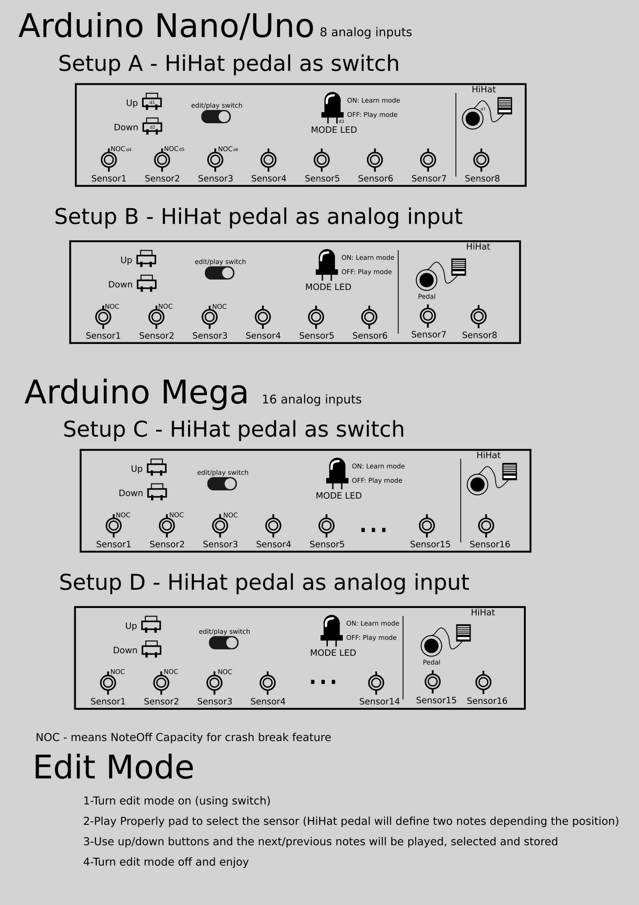

# mvdrum
Minimum Viable Drum (Using Arduino)

## English
> This project proposes to be a simple drum midi controller using arduino.
> The idea is keep it simple, create your own simple and cheap box that solves your problem.
> _for now, we will not provide electronic part documentation, it's easy to deduct reading the Arduino Documentation._
> _for midi USB, buy a cheap Chinese Midi USB cable, it's easy e cheap._

## Português
> Este projeto se propõe a ser um controlador midi simples usando arduino.
> A ideia é mante-lo simples, crie sua caixinha simples e barata que resolve seu problema.
> _Por enquanto, não disponibilizaremos documentação da parte eletrônica, é fácil de deduzir lendo a documentação do Arduino_
> _para midi USB, compre um cabo chinês baratinho, é fácil e barato._

## Four Setup Modes (see the blueprint below)
* For Arduinos with 8 analog inputs
    * Setup A - HiHat using a switch
    * Setup B - HiHat using a switch or an analog input for half HiHat **(in development)**
* For Arduinos with 16 analog inputs
    * Setup C - HiHat using a switch
    * Setup D - HiHat using a switch or an analog input for half HiHat **(in development)**

## New Learn Mode
1. Press up button for 2 seconds (to enter/exit of Learn Mode)
1. Play Properly pad/cymbal to select the sensor
1. Use up/down buttons and the next/previous notes will be played and selected
1. Press up and down button simutaneously for 2 seconds to store selected notes.

## Helpful links (electronic)
[LED Blink](https://www.arduino.cc/en/Tutorial/Blink)
[Push Button](https://www.arduino.cc/en/Tutorial/Button)
[MIDI Out](https://www.arduino.cc/en/Tutorial/Midi)
[Piezo Sensor](https://www.arduino.cc/en/Tutorial/Knock)

## Blueprint
